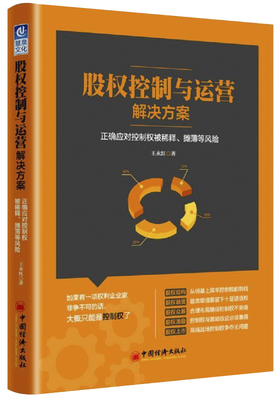

    
*（该封面图来自孔夫子旧书店，抱歉盗了您的图还抹掉了水印，不好意思~:grimacing:）*    
今天总结一下《股权控制与运营解决方案》这本书    
实际上我在3、4月份来公司实习的时候已经读过一遍这本书了，最近二刷。当时觉得这本书非常有意思，有好多我不知道的知识，比如一个公司从创业到上市经过几轮融资，股东之间怎么分配股份有限合伙是什么概念等等，因为有意思才有读下去的动力，这也激起了我对金融投资的兴趣。    
总之，这本书是我在金融投资方面的启蒙老师，这并不是一本网红书，甚至豆瓣都没有评分，多抓鱼上也不收，甚至在结构上和章节安排上有逻辑上的混乱，但其对于我个人来说，价值是有的，正因为章节混乱，我才要把它梳理下来，必要时方便查阅。    
正如其封面上的展示，该书从**股权结构**、**股权融资**、**股权众筹**、**股权激励**、**股权上市**这五个方面介绍了如何在公司成长的过程中牢牢抓住**控制权**，其中列举了近年来圈子里的典型事例，并且对紧握控制权的技巧们进行了反复讲解。    
老规矩，先上目录：    
* 前言
* 第1章 那些著名的股权生死战
* 第2章 股权与控制权，制衡与反制衡的战争
* 第3章 股权结构，从根基上筑牢控制权的防线
* 第4章 股权融资，留下公司绝对话语权
* 第5章 股权众筹，控制权不旁落
* 第6章 股权激励，控制权与激励效应必须兼得
* 第7章 股权上市，控制权博弈的高端战场

简单概括一下每章都讲了啥：   
###### 第1章 那些著名的股权生死战    
近年来的股权（控制权）争夺实例，结果有兄弟反目成仇的，有入狱的，有出局的，当然也有斗智斗勇险些避开风险的。我第一次看这本书时候就是被第一章的故事所吸引了。    
###### 第2章 股权与控制权，制衡与反制衡的战争    
行业术语基本概念科普：股权/股份/股票、持股三种方式等。    
###### 第3章 股权结构，从根基上筑牢控制权的防线    
介绍股权结构的设计及其技巧。    
###### 第4章 股权融资，留下公司绝对话语权    
一个公司的成长过程中要经历好几轮融资，如何准备，融资的流程以及趁机介绍牢牢抓住控制权的技巧。    
###### 第5章 股权众筹，控制权不旁落    
众筹流程以及如何在众筹过程中保住控制权。    
###### 第6章 股权激励，控制权与激励效应必须兼得    
首先介绍了有限合伙的概念，其次对股权激励的每一个步骤进行详细介绍，指出初创企业和上市公司的分别适用哪些股权激励方法。    
###### 第7章 股权上市，控制权博弈的高端战场    
如何上市（选时机、选地点、选板块、选模式），以及如何在控制权争夺中博弈。    

接下来是我的梳理与总结： 
-----------   
##### 术语解释：    
###### 股权、股份和股票
1. 股权 
全称股东权益，是指投资人向公民合伙组织或企业法人投资所享有的权利。根据我国《公司法》，股东享有的权利包括[股东权利内容]( "表格链接")。
2. 股份
三层含义：    
    1. 一定量资本额的代表
    2. 股东出资份额和股东权利大小的表示
    3. 计量股份公司资本的最小计量单位    
其具有**金额性**、**平等性**、**不可分性**、**可转让性**四个特点，可通过股票价格的形式表现其价值。    
3. 股票
其与股份是形式与内容的关系，在股份有限公司成立之后签发。   
###### 持股方式
股东可以通过以下三种方式取得企业的控股权：    
1. 直接持股
股东以自然人身份直接持有股份    
不涉及中间公司，股权结构明晰，运作成本较低。    
2. 间接持股
通过其他载体持有另一公司的股份    
四种方式：    
    1. 收购大股东股权
    2. 对大股东或母公司增资扩股
    3. 出资与大股东成立新公司
    4. 托管    
    
较之于直接持股方式，其优点体现在**规避监管**和**降低税务成本**上   
    
3. 交叉持股/相互持股    
指两个或两个以上公司为了特定目的而相互持有股份 

|优点|缺点|
|-----|------|
|1. 抵御恶意收购    |1. 容易扭曲公司正常估值    |
|2. 发挥各方协同作用    |2. 容易形成行业垄断、滋生内幕交易    |
|3. 分散企业的经营风险    |3. 容易造成公司治理结构失衡   |
|4. 有助于获取资金和提高资金使用效率    | | 
    
###### 股权的八条生命线    

|持股比例|含义|可行使的权利|
|----|:-----------------:|------|
|30% |上市公司要约收购线|依法向该上市公司发出全面要约或者部分要约|
|1/3 |安全控制权|特别决议中，另一方无法达到2/3以上表决权|
|1/2 |相对控制权|过半数|
|2/3 |绝对控制权|2/3以上方可通过|
|1%  |代为诉讼权| |
|3%  |临时提案权| |
|5%  |重大股权变动警示线| |
|10% |临时会议权| |

###### 融资
一家企业从初创到上市，一般会经历五轮融资：    
1. 天使轮
2. A轮
3. B轮
4. Pre-IPO融资
5. IPO    
一个简单的示例（假设的）表明各轮融资后股份的比例变更： [股份计算方法]("Click it")    

融资流程：    
1. 撰写BP（商业计划书）
2. 寻找投资人
3. 约谈
4. 尽职调查
5. 签署协议    
###### 有限合伙    
有限合伙是公司的一种组织形式，由有限合伙人（LP）与普通合伙人（GP）共同组成。  

| |职责|
|-------------|------------|
|普通合伙人    |负责执行合伙企业事务，对外代表合伙企业，对合伙企业债务承担无限制责任|
|有限合伙人    |不参与企业的经营管理，以其出资为限承担责任|    

###### 股权激励
股权激励是促进企业长期发展的一种重要手段，其中，股权激励的方式有以下几种：    

|模式|含义|影响|适用|
|-----|------|--------|----|
|期权/选择权|购买本公司股票的选择权，购买过程称为行权|授权者会分散股权，打破原有股权结构|企业价值看涨，成长性好、具有发展潜力的企业|
|限制性股票|事先授予一定数量的公司股票，对股票的来源、出售条件做出限制|持有的是公司的实际股权，影响创始人的控制权|业绩不佳或处于产业调整过程中的企业|
|虚拟股权|授予对象可享受一定数量的分红权和估价升高收益|不享受普通股东的表决权、分配权，不影响股东结构|现金流量充裕的公司|
|股票增值权|获得一定数量的股票，享受股价上升带来的收益|不实际拥有股票，无表决权、配股权、分红权|现金流充裕且业绩稳定的公司|

###### 股权结构
1. 平衡型    
意见出现分歧时容易形成股东会僵局     
2. 分散型     
没有核心大股东，容易引发公司管理层道德危机    
3. 高度集中型    
形同虚设，一股独大，容易导致决策失误    
4. 核心大股东不明确    
5. 股权结构过于复杂     
人数较多，代持人，期权池，交叉持股，双股权，委托股票权等，容易发生股权纠纷    
6. 外部资本对公司控股     
    1. 创始团队对公司没有实际控制权
    2. 没有预留股权利益空间吸引优秀合伙人加入，影响公司长远发展
    3. 外部资本对公司经营状况了解有限，容易做出错误决策
    
###### 收购规则
1. 二级市场购买    
2. 协议转让
3. 邀约收购（特殊）
    1. 自愿邀约
    2. 强制邀约    
4. 间接收购    

##### 避免控制权沦陷技巧
###### 公司章程
1. 限制控股股东资格条款     
2. 绝对多数条款    
公司进行并购，重大资产转让或者经营管理权的变更时必须取得绝对多数的股东同意才能进行，如2/3    
3. 限制股东提案权条款     

###### 融资中需留意的条款
1. 对堵条款    
财务业绩对堵/上市时间对堵    
2. 强卖权     
投资方在卖出其持有股权时，强制要求创始股东一同卖出股权    
3. 反稀释条款    
4. 管理层对堵    
###### 一再重复
1. AB股制度
2. 管理层收购
3. 归集表决权
    1. 表决权委托
    2. 一致行动协议
4. 创始人否决权

终于，这本书可以还了，谢谢该书在投资方面给我带来的启蒙作用。
我是Clare。
